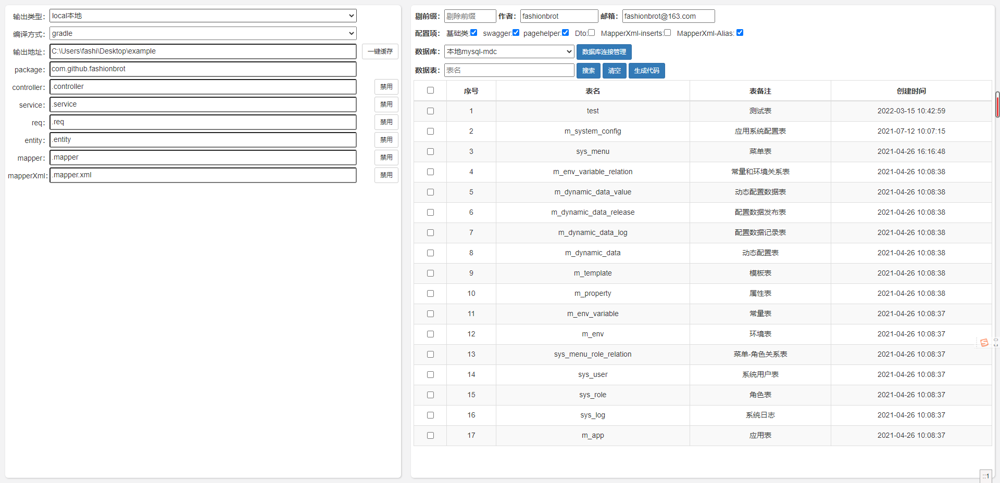
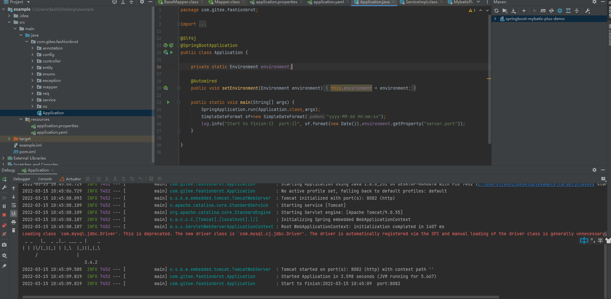
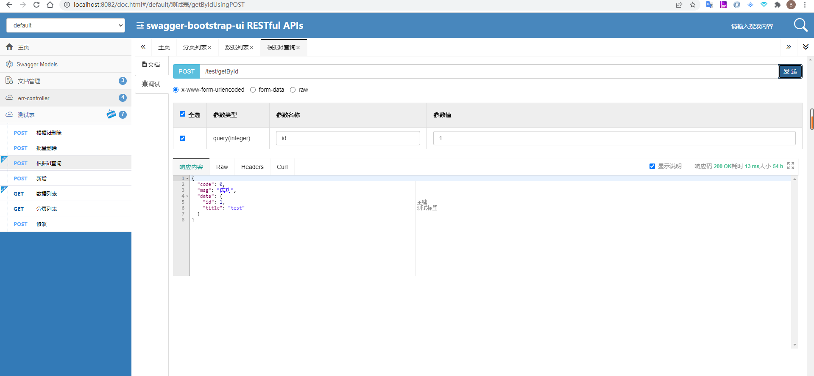
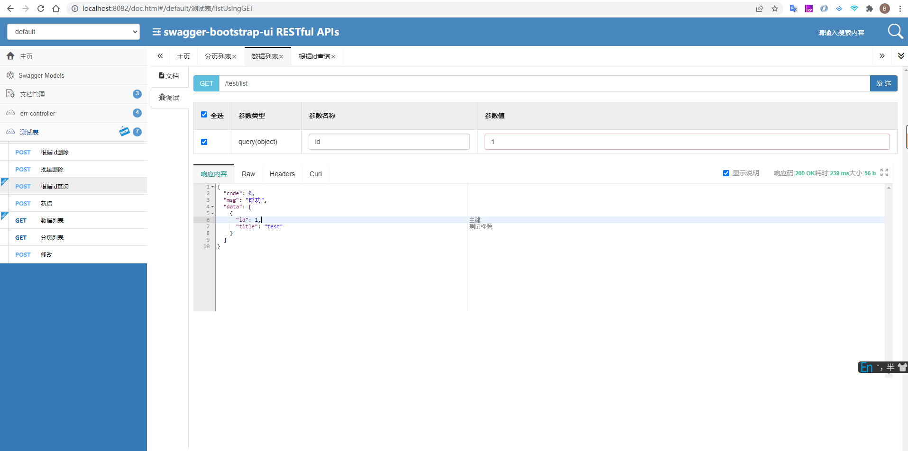
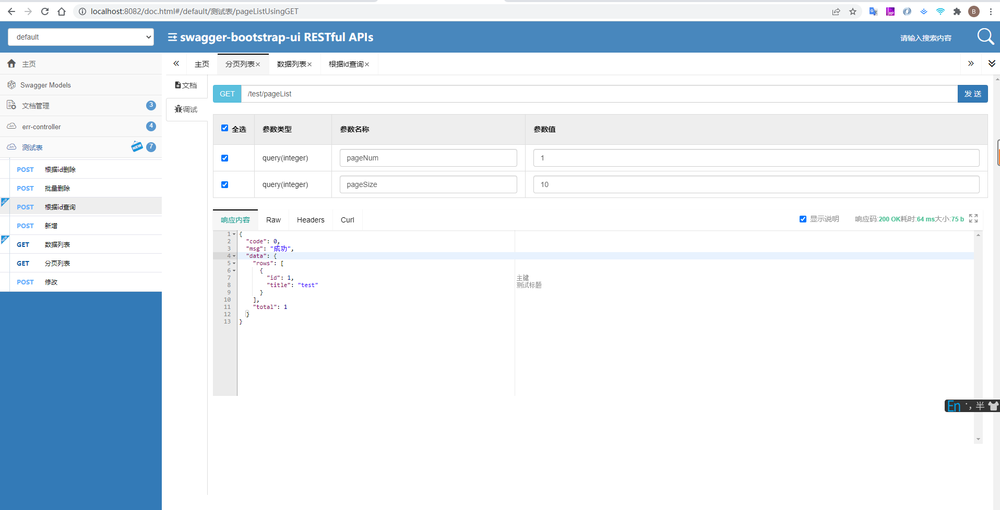

# springboot-quick

#### 介绍
springboot  mybatis-plus  swagger配置 脚手架   

##### gitee：https://gitee.com/fashionbrot/springboot-quick.git
##### github:https://github.com/fashionbrot/springboot-quick.git

#### 1、 springboot 2.6.0
#### 2、mybatis-plus 3.5.1
#### 3、maven
#### 4、gradle
#### 5、swagger

#### 软件架构
软件架构说明

#### 安装教程

访问地址 http://localhost:8081

生产的代码修改数据库配置,和mybatis配置后，可以直接运行
文档地址：http://ip:port/doc.html 

#### 使用说明

下载后直接启动，然后 增加数据库连接配置即可
默认端口 8081

#### 参与贡献

1.  Fork 本仓库
2.  新建 Feat_xxx 分支
3.  提交代码
4.  新建 Pull Request

#### 特技

