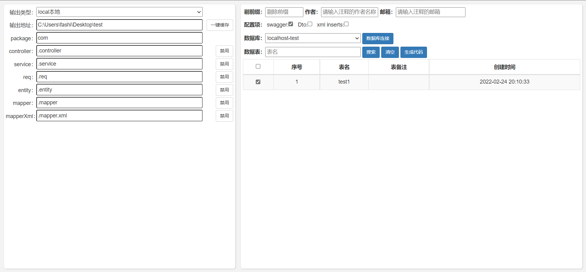

# springboot-quick

#### 介绍
springboot  mybatis-plus  swagger配置 脚手架 

#### 软件架构
软件架构说明

#### 安装教程

访问地址 http://localhost:8081

#### 使用说明

下载后直接启动，然后 增加数据库连接配置即可
默认端口 8081

#### 参与贡献

1.  Fork 本仓库
2.  新建 Feat_xxx 分支
3.  提交代码
4.  新建 Pull Request

#### 特技

